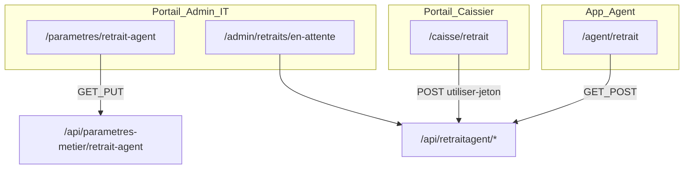
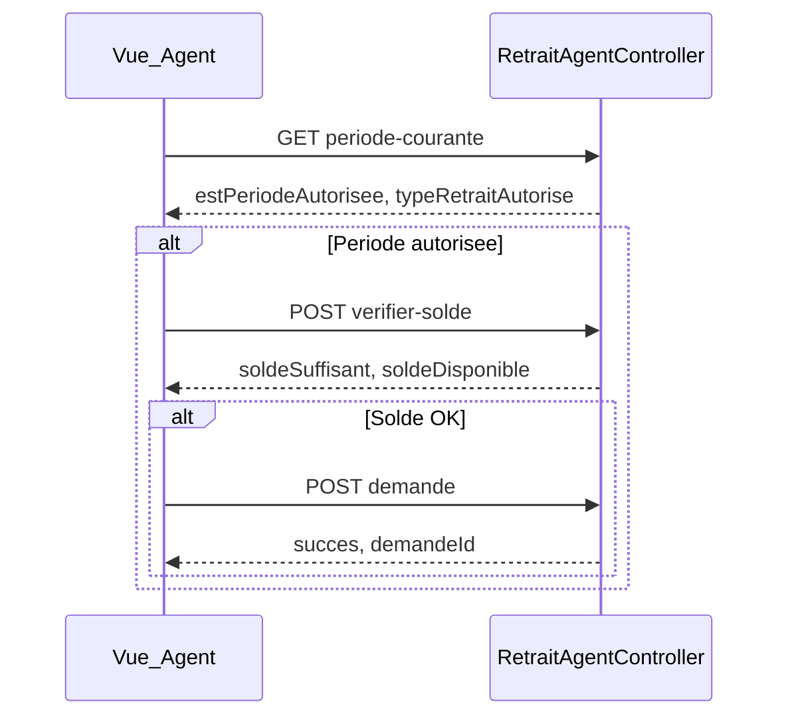

# Intégration Frontend — Retrait Agent (Vue.js)

Ce document guide l'intégration côté **frontend web Vue.js** du module **Retrait Agent** Prosoc : configuration Admin/IT, parcours Agent, validation et paiement caisse.

Documents complémentaires :

- [`PROCESSUS_RETRAIT_AGENT.md`](PROCESSUS_RETRAIT_AGENT.md) — logique métier (fenêtres PARTIEL/TOTAL, workflow complet)
- [`API-DOCUMENTATION-NEW.md`](API-DOCUMENTATION-NEW.md) — référence API globale

> **Hors scope** de ce guide : onglets paramètres `agent-maash`, `arrieres`, `penalite` (autres livrables si besoin).

---

## 1) Prérequis techniques

| Élément | Détail |
|---|---|
| Authentification | JWT Bearer — header `Authorization: Bearer <token>` |
| Format JSON | **camelCase** (sérialisation ASP.NET Core par défaut) |
| Base URL API | ex. `https://dev-prosoc.asdc-rdc.org` (**sans** suffixe `/api`) |
| Permissions paramètres | `READ_PARAMETRES_METIER`, `UPDATE_PARAMETRES_METIER` |
| Permissions caisse | `OPEN_CAISSIER_SESSION`, `READ_CAISSIER_SESSION`, `CONFIRM_RETRAIT_AGENT` |

### Reconnexion après déploiement

Après migration des permissions en UAT/production, demander aux utilisateurs **Admin**, **IT** et **Caissier** de **se reconnecter** pour rafraîchir le JWT (claims `permission`).

### Script SQL UAT (table + permissions + seed)

```bash
mysql -h <host> -u <user> -p <database> < sql/DeployParametresMetierUat.idempotent.sql
```

---

## 2) Cartographie des routes Vue.js suggérées

| Route frontend | Acteur | Rôle API principal |
|---|---|---|
| `/parametres/retrait-agent` | Admin, IT | `GET/PUT /api/parametres-metier/retrait-agent` |
| `/agent/retrait` (ou module wallet) | Agent | `GET periode-courante`, `POST /api/retraitagent` |
| `/admin/retraits/en-attente` | Admin, Superviseur | `GET en-attente`, `POST valider-et-generer-jeton` |
| `/caisse/retrait` | Caissier, Financier | `POST utiliser-jeton` |

### Diagramme de navigation



---

## 3) Permissions et visibilité menu

Les permissions sont des claims multiples `permission` dans le JWT. **Admin** et **SuperAdmin** bypassent côté serveur (`HasPermission` retourne `true`).

| Permission | Rôles typiques | Usage UI |
|---|---|---|
| `READ_PARAMETRES_METIER` | Admin, IT | Afficher menu Paramètres > Retrait agent |
| `UPDATE_PARAMETRES_METIER` | Admin, IT | Bouton Enregistrer actif sur le formulaire |
| `CONFIRM_RETRAIT_AGENT` | Caissier (+ Admin bypass) | Écran paiement jeton au guichet |
| `OPEN_CAISSIER_SESSION` | Caissier | Ouvrir session avant paiement |
| `READ_CAISSIER_SESSION` | Caissier | Consulter session courante / solde |

Les endpoints opérationnels `retraitagent/*` exigent un JWT valide (`[Authorize]`) mais **pas de permission dédiée** sur la plupart des routes. Filtrer l'accès UI par **rôle métier** (Agent, Admin, Caissier).

Les routes paiement (`utiliser-jeton`, `marquer-paye`) exigent en plus le rôle JWT : `Admin`, `Caissier` ou `Financier`.

---

## 4) Module Admin — Paramètres Retrait Agent

Source backend : `ParametresMetierController`, DTOs `RetraitAgentParametresReadDto` / `RetraitAgentParametresUpdateDto`.

| Méthode | Route | Body / Response |
|---|---|---|
| GET | `/api/parametres-metier/retrait-agent` | `RetraitAgentParametresReadDto` (+ audit) |
| PUT | `/api/parametres-metier/retrait-agent` | `RetraitAgentParametresUpdateDto` → même ReadDto |

### Exemple GET (réponse)

```json
{
  "fenetre1Debut": 15,
  "fenetre1Fin": 20,
  "fenetre2DerniersJours": 7,
  "montantMinimumPartiel": 5,
  "dateModification": "2026-07-10T09:30:00",
  "modifieParUtilisateurId": 3,
  "modifieParNom": "Admin Prosoc"
}
```

### Exemple PUT (requête)

```json
{
  "fenetre1Debut": 15,
  "fenetre1Fin": 20,
  "fenetre2DerniersJours": 7,
  "montantMinimumPartiel": 5
}
```

### Règles de validation client (miroir `RetraitAgentParametresValidator`)

| Champ | Règle |
|---|---|
| `fenetre1Debut` | Entier 1–28 |
| `fenetre1Fin` | ≥ `fenetre1Debut`, ≤ 31 |
| `fenetre2DerniersJours` | Entier 1–15 |
| `montantMinimumPartiel` | > 0 |
| Chevauchement fenêtres | Interdit (vérifier mois courts : février, avril…) |

**Preview fenêtre 2** (affichage informatif dans le formulaire) :

```
fenetre2Debut = dernierJourMois - fenetre2DerniersJours + 1
fenetre2Fin   = dernierJourMois
```

Exemple pour juillet (31 jours) avec `fenetre2DerniersJours = 7` → jours **25–31**.

### Wireframe formulaire (4 champs + bandeau)

```
┌─────────────────────────────────────────────────────────┐
│ Paramètres — Retrait agent                              │
├─────────────────────────────────────────────────────────┤
│ Fenêtre 1 — début (jour)     [ 15 ]                     │
│ Fenêtre 1 — fin (jour)       [ 20 ]   → retrait PARTIEL │
│ Fenêtre 2 — derniers jours   [  7 ]   → retrait TOTAL   │
│ Montant minimum PARTIEL      [  5 ] USD                 │
│                                                         │
│ ℹ Fenêtre 2 ce mois : jours 25–31 (calcul preview)      │
│ ℹ Les changements sont effectifs sans redémarrage API   │
├─────────────────────────────────────────────────────────┤
│ Modifié le 10/07/2026 par Admin Prosoc                  │
│                              [ Enregistrer ] (UPDATE_*) │
└─────────────────────────────────────────────────────────┘
```

---

## 5) Module Agent — Consultation et demande

Base : `/api/retraitagent/*` — JWT requis.

| Méthode | Route | Usage |
|---|---|---|
| GET | `/api/retraitagent/periode-courante` | Bandeau période ouverte/fermée, type PARTIEL/TOTAL |
| POST | `/api/retraitagent/verifier-periode` | Body : date ISO `"2026-03-16"` |
| POST | `/api/retraitagent/verifier-solde` | Body : `{ agentId, montantDemande }` |
| POST | `/api/retraitagent` | Création demande |
| GET | `/api/retraitagent/by-agent/{agentId}` | Historique agent |

### Exemple `periode-courante`

```json
{
  "date": "2026-07-16T00:00:00",
  "estPeriodeAutorisee": true,
  "message": "Période de retrait autorisée — fenêtre PARTIEL (jours 15–20)",
  "jourDuMois": 16,
  "periodeInfo": "Fenêtre 1",
  "fenetre1Debut": 15,
  "fenetre1Fin": 20,
  "fenetre2Debut": 25,
  "fenetre2Fin": 31,
  "fenetreActive": "FENETRE_1",
  "typeRetraitAutorise": "PARTIEL",
  "montantMinimumPartiel": 5,
  "montantDemandeRequis": true
}
```

### Exemple création demande (POST)

```json
{
  "agentId": 42,
  "montantDemande": 150.00,
  "typeRetrait": "PARTIEL",
  "motifRetrait": "Besoin personnel"
}
```

Réponse succès (`RetraitWorkflowResultDto`) :

```json
{
  "succes": true,
  "message": "Demande de retrait créée avec succès",
  "demandeId": 101,
  "montantRetrait": 150.00,
  "typeRetrait": "PARTIEL"
}
```

### Règles UI critiques

| Condition API | Comportement UI |
|---|---|
| `estPeriodeAutorisee === false` | Désactiver bouton « Demander un retrait » |
| `typeRetraitAutorise === 'PARTIEL'` | Champ montant **obligatoire**, min = `montantMinimumPartiel` |
| `typeRetraitAutorise === 'TOTAL'` | Masquer saisie montant ; afficher solde complet |
| `montantDemandeRequis === true` | Validation formulaire côté client |
| `typeRetrait` envoyé par le client | **Ignoré** par l'API si incompatible avec la fenêtre |

### Flux séquence Agent



---

## 6) Module Validateur — File d'attente et jeton

| Méthode | Route | Usage |
|---|---|---|
| GET | `/api/retraitagent/en-attente` | Liste demandes `EN_ATTENTE` |
| GET | `/api/retraitagent/validees` | Suivi post-validation |
| GET | `/api/retraitagent/traitees` | Demandes payées |
| GET | `/api/retraitagent?page=1&pageSize=20` | Liste paginée complète |
| POST | `/api/retraitagent/valider-et-generer-jeton` | Validation + émission jeton |
| PUT | `/api/retraitagent/{id}` | Rejet manuel (`statutDemande: REJETEE`) |

### Body validation (`valider-et-generer-jeton`)

```json
{
  "idDemande": 42,
  "statutDemande": "VALIDEE",
  "agentValidationId": 7,
  "motifValidation": null
}
```

> Pour la validation avec jeton, utiliser **`valider-et-generer-jeton`** (pas seulement PUT). Le PUT sert au rejet ou mise à jour statut sans génération jeton.

### Réponse succès (afficher jeton)

```json
{
  "succes": true,
  "message": "Demande validée et jeton généré",
  "demandeId": 42,
  "jetonId": 88,
  "jetonCode": "RTA-20260716-ABC123",
  "montantRetrait": 150.00,
  "dateEmission": "2026-07-16T10:00:00",
  "dateExpiration": "2026-07-23T10:00:00"
}
```

**UI recommandée** : afficher `jetonCode` en grand (QR code optionnel), `dateExpiration`, `montantRetrait` + devise.

### Body rejet (PUT)

```json
{
  "idDemande": 42,
  "statutDemande": "REJETEE",
  "agentValidationId": 7,
  "motifValidation": "Solde insuffisant après vérification"
}
```

---

## 7) Module Caissier — Paiement jeton

| Méthode | Route | Auth |
|---|---|---|
| POST | `/api/retraitagent/utiliser-jeton` | Rôles `Admin`, `Caissier`, `Financier` |
| POST | `/api/retraitagent/marquer-paye` | Alias identique |

### Body `JetonRetraitUtilisationDto`

```json
{
  "idJeton": 88,
  "codeJeton": "RTA-20260716-ABC123",
  "agentId": 42,
  "observationUtilisation": "Paiement guichet principal",
  "sessionCaisseId": null
}
```

`sessionCaisseId` est **optionnel** : si omis, l'API utilise la session **OUVERTE** du caissier connecté.

### Prérequis session caisse

Avant paiement, vérifier qu'une session est ouverte :

| Méthode | Route | Usage |
|---|---|---|
| GET | `/api/Caisse/session/courante` | Session ouverte du caissier (404 si aucune) |
| POST | `/api/Caisse/session/ouvrir` | Ouvrir session (`OPEN_CAISSIER_SESSION`) |
| GET | `/api/Caisse/session/{id}/solde` | Solde disponible en caisse |

Si aucune session ouverte → `codeErreur: SESSION_CAISSIER_REQUISE` (400).

### Codes erreur paiement (`RetraitPaiementResultDto`)

| `codeErreur` | HTTP | Message UI suggéré |
|---|---|---|
| `SESSION_CAISSIER_REQUISE` | 400 | Ouvrez une session de caisse avant de payer |
| `JETON_EXPIRE` | 400 | Jeton expiré — demander un nouveau jeton |
| `JETON_DEJA_UTILISE` | **409** | Ce jeton a déjà été utilisé |
| `SOLDE_CAISSE_INSUFFISANT` | 400 | Solde caisse insuffisant |
| `HORS_PERIODE` | 400 | Période de retrait fermée |

### Réponse succès

```json
{
  "succes": true,
  "message": "Retrait payé avec succès",
  "demandeId": 42,
  "jetonId": 88,
  "jetonCode": "RTA-20260716-ABC123",
  "montantPaye": 150.00,
  "soldeWalletApres": 0.00,
  "soldeCaisseSessionApres": 425000.00,
  "sessionCaisseId": 12
}
```

---

## 8) Contrats TypeScript

Créer `src/types/retraitAgent.ts` :

```ts
/** Réponse paginée standard Prosoc */
export interface PaginatedResponse<T> {
  data: T[];
  currentPage: number;
  pageSize: number;
  totalItems: number;
  totalPages: number;
  hasNextPage: boolean;
  hasPreviousPage: boolean;
  startItem?: number;
  endItem?: number;
}

/** Paramètres métier — Admin */
export interface RetraitAgentParametresReadDto {
  fenetre1Debut: number;
  fenetre1Fin: number;
  fenetre2DerniersJours: number;
  montantMinimumPartiel: number;
  dateModification?: string | null;
  modifieParUtilisateurId?: number | null;
  modifieParNom?: string | null;
}

export interface RetraitAgentParametresUpdateDto {
  fenetre1Debut: number;
  fenetre1Fin: number;
  fenetre2DerniersJours: number;
  montantMinimumPartiel: number;
}

/** Période courante — Agent */
export interface PeriodeRetraitCouranteDto {
  date: string;
  estPeriodeAutorisee: boolean;
  message: string;
  jourDuMois: number;
  periodeInfo: string;
  fenetre1Debut: number;
  fenetre1Fin: number;
  fenetre2Debut: number;
  fenetre2Fin: number;
  fenetreActive?: string | null;
  typeRetraitAutorise?: string | null;
  montantMinimumPartiel: number;
  montantDemandeRequis: boolean;
}

export interface PeriodeRetraitVerificationDto {
  date: string;
  estPeriodeAutorisee: boolean;
  message: string;
  jourDuMois: number;
  periodeInfo: string;
}

/** Demande de retrait */
export interface DemandeRetraitAgentReadDto {
  idDemande: number;
  agentId: number;
  agentNom?: string | null;
  agentMatricule?: string | null;
  montantDemande: number;
  typeRetrait: string;
  statutDemande: string;
  motifRetrait?: string | null;
  motifRejet?: string | null;
  deviseId?: number | null;
  deviseCode?: string | null;
  deviseSymbole?: string | null;
  dateDemande: string;
  dateValidation?: string | null;
  dateTraitement?: string | null;
  agentValidationId?: number | null;
  agentValidationNom?: string | null;
  jetonRetraitId?: number | null;
  jetonRetraitCode?: string | null;
  dateCreation: string;
  dateModification?: string | null;
  statut: boolean;
}

export interface DemandeRetraitAgentCreateDto {
  agentId: number;
  montantDemande?: number | null;
  typeRetrait?: string | null;
  motifRetrait?: string | null;
}

export interface DemandeRetraitAgentValidationDto {
  idDemande: number;
  statutDemande: 'VALIDEE' | 'REJETEE' | string;
  motifValidation?: string | null;
  agentValidationId: number;
}

/** Vérification solde */
export interface SoldeVerificationDto {
  agentId: number;
  agentNom?: string | null;
  soldeDisponible: number;
  montantDemande: number;
  soldeSuffisant: boolean;
  difference: number;
  message: string;
  deviseId?: number | null;
  deviseCode?: string | null;
  deviseSymbole?: string | null;
}

/** Résultats workflow */
export interface RetraitWorkflowResultDto {
  succes: boolean;
  message: string;
  demandeId?: number | null;
  jetonId?: number | null;
  jetonCode?: string | null;
  montantRetrait?: number | null;
  typeRetrait?: string | null;
  deviseId?: number | null;
  deviseCode?: string | null;
  deviseSymbole?: string | null;
  dateEmission?: string | null;
  dateExpiration?: string | null;
}

/** Paiement caisse */
export interface JetonRetraitUtilisationDto {
  idJeton: number;
  codeJeton: string;
  agentId: number;
  observationUtilisation?: string | null;
  sessionCaisseId?: number | null;
}

export interface RetraitPaiementResultDto {
  succes: boolean;
  message: string;
  codeErreur?: string | null;
  demandeId?: number | null;
  jetonId?: number | null;
  jetonCode?: string | null;
  montantPaye?: number | null;
  soldeWalletApres?: number | null;
  soldeCaisseSessionApres?: number | null;
  walletMouvementId?: number | null;
  mouvementCaisseId?: number | null;
  sessionCaisseId?: number | null;
}

/** Statistiques (optionnel — écran reporting) */
export interface DemandeRetraitAgentStatsDto {
  totalDemandes: number;
  demandesEnAttente: number;
  demandesValidees: number;
  demandesRejetees: number;
  demandesTraitees: number;
  totalMontantDemande: number;
  totalMontantTraite: number;
  tauxValidation: number;
  dateStats: string;
}

export type TypeRetraitAutorise = 'PARTIEL' | 'TOTAL';
export type StatutDemandeRetrait = 'EN_ATTENTE' | 'VALIDEE' | 'REJETEE' | 'TRAITEE';
```

---

## 9) Services Axios et composables Vue

### Instance Axios (`src/plugins/axios.ts`)

Réutiliser le même client que les autres modules (voir [`FRONTEND_INTEGRATION_STATISTIQUES.md`](FRONTEND_INTEGRATION_STATISTIQUES.md)) :

```ts
import axios from 'axios';
import { useAuthStore } from '@/stores/auth';

export const apiClient = axios.create({
  baseURL: import.meta.env.VITE_API_BASE_URL,
  headers: { Accept: 'application/json' },
});

apiClient.interceptors.request.use((config) => {
  const auth = useAuthStore();
  if (auth.token) {
    config.headers.Authorization = `Bearer ${auth.token}`;
  }
  return config;
});

// Interceptor 403 : masquer routes /parametres/* si claim absent
apiClient.interceptors.response.use(
  (response) => response,
  (error) => {
    if (axios.isAxiosError(error) && error.response?.status === 403) {
      const url = error.config?.url ?? '';
      if (url.includes('/parametres-metier')) {
        // Émettre un event global ou rediriger vers forbidden
      }
    }
    return Promise.reject(error);
  },
);
```

### Service paramètres (`src/services/parametresMetierService.ts`)

```ts
import type { AxiosInstance } from 'axios';
import type {
  RetraitAgentParametresReadDto,
  RetraitAgentParametresUpdateDto,
} from '@/types/retraitAgent';

export function createParametresMetierApi(client: AxiosInstance) {
  return {
    getRetraitAgent: () =>
      client.get<RetraitAgentParametresReadDto>('/api/parametres-metier/retrait-agent'),

    updateRetraitAgent: (dto: RetraitAgentParametresUpdateDto) =>
      client.put<RetraitAgentParametresReadDto>('/api/parametres-metier/retrait-agent', dto),
  };
}
```

### Service retrait agent (`src/services/retraitAgentService.ts`)

```ts
import type { AxiosInstance } from 'axios';
import type {
  DemandeRetraitAgentCreateDto,
  DemandeRetraitAgentReadDto,
  DemandeRetraitAgentValidationDto,
  JetonRetraitUtilisationDto,
  PaginatedResponse,
  PeriodeRetraitCouranteDto,
  RetraitPaiementResultDto,
  RetraitWorkflowResultDto,
  SoldeVerificationDto,
} from '@/types/retraitAgent';

export function createRetraitAgentApi(client: AxiosInstance) {
  return {
    // Agent
    getPeriodeCourante: () =>
      client.get<PeriodeRetraitCouranteDto>('/api/retraitagent/periode-courante'),

    verifierPeriode: (dateIso: string) =>
      client.post<PeriodeRetraitCouranteDto>('/api/retraitagent/verifier-periode', dateIso, {
        headers: { 'Content-Type': 'application/json' },
      }),

    verifierSolde: (agentId: number, montantDemande: number) =>
      client.post<SoldeVerificationDto>('/api/retraitagent/verifier-solde', {
        agentId,
        montantDemande,
      }),

    creerDemande: (dto: DemandeRetraitAgentCreateDto) =>
      client.post<RetraitWorkflowResultDto>('/api/retraitagent', dto),

    getHistoriqueAgent: (agentId: number) =>
      client.get<DemandeRetraitAgentReadDto[]>(`/api/retraitagent/by-agent/${agentId}`),

    // Validateur
    getEnAttente: () =>
      client.get<DemandeRetraitAgentReadDto[]>('/api/retraitagent/en-attente'),

    getValidees: () =>
      client.get<DemandeRetraitAgentReadDto[]>('/api/retraitagent/validees'),

    getPaginated: (page = 1, pageSize = 20) =>
      client.get<PaginatedResponse<DemandeRetraitAgentReadDto>>('/api/retraitagent', {
        params: { page, pageSize },
      }),

    validerEtGenererJeton: (dto: DemandeRetraitAgentValidationDto) =>
      client.post<RetraitWorkflowResultDto>('/api/retraitagent/valider-et-generer-jeton', dto),

    rejeterDemande: (id: number, dto: DemandeRetraitAgentValidationDto) =>
      client.put<DemandeRetraitAgentReadDto>(`/api/retraitagent/${id}`, dto),

    // Caissier
    utiliserJeton: (dto: JetonRetraitUtilisationDto) =>
      client.post<RetraitPaiementResultDto>('/api/retraitagent/utiliser-jeton', dto),

    marquerPaye: (dto: JetonRetraitUtilisationDto) =>
      client.post<RetraitPaiementResultDto>('/api/retraitagent/marquer-paye', dto),
  };
}
```

### Composable période Agent (`src/composables/useRetraitPeriode.ts`)

```ts
import { ref, computed, onMounted } from 'vue';
import axios from 'axios';
import { apiClient } from '@/plugins/axios';
import { createRetraitAgentApi } from '@/services/retraitAgentService';
import type { PeriodeRetraitCouranteDto } from '@/types/retraitAgent';

const retraitApi = createRetraitAgentApi(apiClient);

export function useRetraitPeriode() {
  const loading = ref(false);
  const error = ref<string | null>(null);
  const periode = ref<PeriodeRetraitCouranteDto | null>(null);

  const peutDemander = computed(() => periode.value?.estPeriodeAutorisee === true);
  const estPartiel = computed(() => periode.value?.typeRetraitAutorise === 'PARTIEL');
  const estTotal = computed(() => periode.value?.typeRetraitAutorise === 'TOTAL');
  const montantMin = computed(() => periode.value?.montantMinimumPartiel ?? 0);

  async function chargerPeriode() {
    loading.value = true;
    error.value = null;
    try {
      const { data } = await retraitApi.getPeriodeCourante();
      periode.value = data;
    } catch (e: unknown) {
      error.value = extractApiError(e);
    } finally {
      loading.value = false;
    }
  }

  onMounted(() => chargerPeriode());

  return { loading, error, periode, peutDemander, estPartiel, estTotal, montantMin, chargerPeriode };
}

function extractApiError(e: unknown): string {
  if (axios.isAxiosError(e)) {
    const msg = (e.response?.data as { message?: string })?.message;
    return msg ?? 'Erreur lors du chargement de la période de retrait';
  }
  return 'Erreur inattendue';
}
```

### Composable formulaire paramètres (`src/composables/useRetraitParametresForm.ts`)

```ts
import { ref, computed } from 'vue';
import { z } from 'zod';
import { apiClient } from '@/plugins/axios';
import { createParametresMetierApi } from '@/services/parametresMetierService';
import type { RetraitAgentParametresReadDto, RetraitAgentParametresUpdateDto } from '@/types/retraitAgent';

const parametresApi = createParametresMetierApi(apiClient);

const schema = z.object({
  fenetre1Debut: z.number().int().min(1).max(28),
  fenetre1Fin: z.number().int().min(1).max(31),
  fenetre2DerniersJours: z.number().int().min(1).max(15),
  montantMinimumPartiel: z.number().positive(),
}).refine((d) => d.fenetre1Fin >= d.fenetre1Debut, {
  message: 'La fin de fenêtre 1 doit être ≥ au début',
  path: ['fenetre1Fin'],
});

export function useRetraitParametresForm() {
  const loading = ref(false);
  const saving = ref(false);
  const error = ref<string | null>(null);
  const data = ref<RetraitAgentParametresReadDto | null>(null);
  const form = ref<RetraitAgentParametresUpdateDto>({
    fenetre1Debut: 15,
    fenetre1Fin: 20,
    fenetre2DerniersJours: 7,
    montantMinimumPartiel: 5,
  });

  const fenetre2Preview = computed(() => {
    const now = new Date();
    const dernierJour = new Date(now.getFullYear(), now.getMonth() + 1, 0).getDate();
    const debut = Math.max(1, dernierJour - form.value.fenetre2DerniersJours + 1);
    return { debut, fin: dernierJour };
  });

  async function charger() {
    loading.value = true;
    error.value = null;
    try {
      const { data: dto } = await parametresApi.getRetraitAgent();
      data.value = dto;
      form.value = {
        fenetre1Debut: dto.fenetre1Debut,
        fenetre1Fin: dto.fenetre1Fin,
        fenetre2DerniersJours: dto.fenetre2DerniersJours,
        montantMinimumPartiel: dto.montantMinimumPartiel,
      };
    } catch (e: unknown) {
      error.value = 'Impossible de charger les paramètres';
      throw e;
    } finally {
      loading.value = false;
    }
  }

  async function enregistrer() {
    const parsed = schema.safeParse(form.value);
    if (!parsed.success) {
      error.value = parsed.error.errors[0]?.message ?? 'Formulaire invalide';
      return false;
    }
    saving.value = true;
    error.value = null;
    try {
      const { data: dto } = await parametresApi.updateRetraitAgent(form.value);
      data.value = dto;
      return true;
    } catch (e: unknown) {
      error.value = (e as { response?: { data?: { message?: string } } })?.response?.data?.message
        ?? 'Erreur lors de l\'enregistrement';
      return false;
    } finally {
      saving.value = false;
    }
  }

  return { loading, saving, error, data, form, fenetre2Preview, charger, enregistrer };
}
```

### Composable workflow caissier (`src/composables/useRetraitWorkflow.ts`)

```ts
import { ref } from 'vue';
import axios from 'axios';
import { apiClient } from '@/plugins/axios';
import { createRetraitAgentApi } from '@/services/retraitAgentService';
import type { JetonRetraitUtilisationDto, RetraitPaiementResultDto } from '@/types/retraitAgent';

const retraitApi = createRetraitAgentApi(apiClient);

export function useRetraitWorkflow() {
  const loading = ref(false);
  const result = ref<RetraitPaiementResultDto | null>(null);
  const error = ref<string | null>(null);

  async function payerJeton(dto: JetonRetraitUtilisationDto) {
    loading.value = true;
    error.value = null;
    result.value = null;
    try {
      const { data } = await retraitApi.utiliserJeton(dto);
      result.value = data;
      if (!data.succes) {
        error.value = data.message;
      }
      return data;
    } catch (e: unknown) {
      if (axios.isAxiosError(e)) {
        const body = e.response?.data as RetraitPaiementResultDto | { message?: string };
        error.value = 'message' in body && body.message
          ? body.message
          : 'Erreur lors du paiement';
        if ('codeErreur' in body && body.codeErreur) {
          error.value = `[${body.codeErreur}] ${body.message}`;
        }
      }
      throw e;
    } finally {
      loading.value = false;
    }
  }

  return { loading, result, error, payerJeton };
}
```

### Garde de route (extrait)

```ts
// src/router/guards/parametresMetierGuard.ts
import type { NavigationGuard } from 'vue-router';
import { useAuthStore } from '@/stores/auth';
import { hasPermission } from '@/utils/permissions';

export const parametresRetraitAgentGuard: NavigationGuard = (_to, _from, next) => {
  const auth = useAuthStore();
  if (!auth.token) return next({ name: 'login' });
  if (!hasPermission(auth.token, 'READ_PARAMETRES_METIER')) {
    return next({ name: 'forbidden' });
  }
  next();
};
```

---

## 10) Mapping données → composants UI

| Donnée API | Composant UI suggéré |
|---|---|
| `periode.fenetre1Debut/Fin` + `fenetre2Debut/Fin` | Calendrier mensuel / bandeau dates |
| `estPeriodeAutorisee` | Badge vert (ouvert) / rouge (fermé) |
| `typeRetraitAutorise` | Label « Retrait partiel » ou « Retrait total » |
| `montantMinimumPartiel` | Hint sous input montant (PARTIEL) |
| `modifieParNom`, `dateModification` | Footer formulaire paramètres |
| `jetonCode` | QR code ou code large après validation |
| `dateExpiration` | Compte à rebours ou date limite |
| `codeErreur` (paiement) | Toast erreur métier avec action corrective |
| `soldeDisponible` | Affichage wallet agent avant demande |
| `statutDemande` | Badge dans tableau historique |

### Statuts demande — couleurs suggérées

| Statut | Couleur |
|---|---|
| `EN_ATTENTE` | Orange |
| `VALIDEE` | Bleu |
| `REJETEE` | Rouge |
| `TRAITEE` | Vert |

---

## 11) Gestion des erreurs HTTP

| Code | Contexte | Corps typique | Action UI |
|---|---|---|---|
| **401** | Token absent/expiré | `{ error: "..." }` | Rediriger login |
| **403** | Paramètres sans permission | `{ message: "Permission requise : READ_PARAMETRES_METIER" }` | Page forbidden + masquer menu |
| **400** | Validation paramètres | `{ message: "Les fenêtres 1 et 2 ne doivent pas se chevaucher..." }` | Afficher sous le formulaire |
| **400** | Création/validation demande | `RetraitWorkflowResultDto` avec `succes: false` | Toast + `message` |
| **400** | Paiement jeton | `RetraitPaiementResultDto` avec `codeErreur` | Toast contextualisé |
| **409** | Jeton déjà utilisé | `{ succes: false, codeErreur: "JETON_DEJA_UTILISE", ... }` | Bloquer double saisie |
| **404** | Demande/jeton introuvable | `{ error: "Demande de retrait non trouvée" }` | Retour liste |
| **404** | Session caisse absente | `{ error: "Aucune session de caisse ouverte" }` | Lien ouvrir session |
| **500** | Erreur technique | `{ message: "Erreur serveur" }` | Bouton Réessayer |

---

## 12) Structure dossiers frontend suggérée

```
src/
├── types/
│   └── retraitAgent.ts
├── services/
│   ├── parametresMetierService.ts
│   └── retraitAgentService.ts
├── composables/
│   ├── useRetraitParametresForm.ts
│   ├── useRetraitPeriode.ts
│   └── useRetraitWorkflow.ts
├── utils/
│   └── permissions.ts          # READ/UPDATE_PARAMETRES_METIER, CONFIRM_RETRAIT_AGENT
├── router/guards/
│   └── parametresMetierGuard.ts
├── components/retrait/
│   ├── PeriodeRetraitBanner.vue
│   ├── DemandeRetraitForm.vue
│   ├── RetraitsEnAttenteTable.vue
│   ├── JetonDisplay.vue
│   └── PaiementJetonForm.vue
└── views/
    ├── parametres/RetraitAgentParametresView.vue
    ├── agent/RetraitAgentView.vue
    ├── admin/RetraitsEnAttenteView.vue
    └── caisse/RetraitPaiementView.vue
```

---

## 13) Checklist tests manuels frontend

### Admin / IT — Paramètres

- [ ] GET `/api/parametres-metier/retrait-agent` avec compte IT → formulaire pré-rempli
- [ ] PUT valeurs valides → 200, audit `modifieParNom` mis à jour
- [ ] PUT chevauchement fenêtres (ex. fenêtre1Fin=28, fenetre2DerniersJours=10) → 400 + message
- [ ] Compte sans `READ_PARAMETRES_METIER` → menu masqué / 403

### Agent

- [ ] Hors période → `estPeriodeAutorisee: false`, bouton demande désactivé
- [ ] Fenêtre PARTIEL → champ montant obligatoire, refus si < `montantMinimumPartiel`
- [ ] Fenêtre TOTAL → pas de saisie montant, solde complet affiché
- [ ] POST demande succès → historique `by-agent/{id}` mis à jour

### Validateur

- [ ] GET `en-attente` liste les demandes `EN_ATTENTE`
- [ ] POST `valider-et-generer-jeton` → affichage `jetonCode`, `dateExpiration`
- [ ] PUT rejet → statut `REJETEE`, motif visible

### Caissier

- [ ] Sans session ouverte → `SESSION_CAISSIER_REQUISE`
- [ ] GET `Caisse/session/courante` OK → paiement jeton → succès
- [ ] Second paiement même jeton → 409 `JETON_DEJA_UTILISE`

### Cohérence paramètres

- [ ] Après PUT paramètres Admin : GET `periode-courante` côté Agent reflète les nouvelles valeurs **sans redémarrage API**

### Tests cURL rapides

```bash
TOKEN="eyJhbGciOiJIUzI1NiIs..."
BASE="https://dev-prosoc.asdc-rdc.org"

# Paramètres
curl -s "$BASE/api/parametres-metier/retrait-agent" \
  -H "Authorization: Bearer $TOKEN" | jq .

# Période courante (agent)
curl -s "$BASE/api/retraitagent/periode-courante" \
  -H "Authorization: Bearer $TOKEN" | jq .

# File d'attente (validateur)
curl -s "$BASE/api/retraitagent/en-attente" \
  -H "Authorization: Bearer $TOKEN" | jq .

# Session caisse (caissier)
curl -s "$BASE/api/Caisse/session/courante" \
  -H "Authorization: Bearer $TOKEN" | jq .
```

---

## Références backend

| Fichier | Rôle |
|---|---|
| `Controllers/ParametresMetierController.cs` | Endpoints paramètres |
| `Controllers/RetraitAgentController.cs` | Workflow opérationnel |
| `Controllers/CaisseController.cs` | Session caisse |
| `Models/DTOs/Core/ParametresMetierDtos.cs` | Contrats config |
| `Models/DTOs/Core/RetraitAgentDtos.cs` | Contrats workflow |
| `Utilities/RetraitAgentParametresValidator.cs` | Règles validation paramètres |
| `PROCESSUS_RETRAIT_AGENT.md` | Logique métier détaillée |
