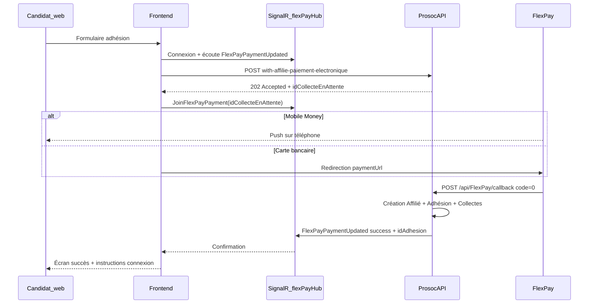
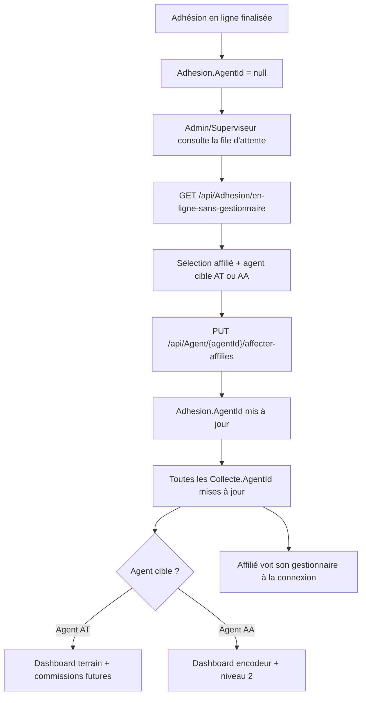

# Processus d'adhésion en ligne et affectation agent

Ce document décrit le parcours **adhésion en ligne en accès libre** (sans session agent) et, dans une deuxième partie, le **processus d'affectation** du nouvel affilié à un agent gestionnaire.

Documents connexes :

- [`FRONTEND_INTEGRATION_ADHESION_FLEXPAY.md`](FRONTEND_INTEGRATION_ADHESION_FLEXPAY.md) — intégration technique FlexPay / SignalR
- [`ANALYSE_ADHESION_CREATION_AFFILIE.md`](ANALYSE_ADHESION_CREATION_AFFILIE.md) — détail de la création affilié / wallets
- [`API-DOCUMENTATION-NEW.md`](API-DOCUMENTATION-NEW.md) — référence API (sections adhésion en ligne)

---

## Vue d'ensemble : terrain vs en ligne

| Aspect | Adhésion **terrain** (agent) | Adhésion **en ligne** (accès libre) |
|--------|-------------------------------|-------------------------------------|
| Endpoint principal | `POST /api/Adhesion/with-affilie` | `POST /api/Adhesion/with-affilie-paiement-electronique` |
| Authentification | JWT optionnel ; **`agentId` obligatoire** dans le body | **`[AllowAnonymous]`** — pas de JWT requis |
| Paiement | Espèces, virement, chèque, compte virtuel agent | **FlexPay uniquement** (Mobile Money ou Carte bancaire) |
| Création en base | **Immédiate** (synchrone) | **Différée** — uniquement après callback FlexPay succès |
| `Adhesion.AgentId` | = agent créateur (AT) | **`null`** jusqu'à affectation admin |
| `Collecte.AgentId` | = agent créateur | **`null`** jusqu'à affectation admin |
| Commission agent | Créditée à la création | **Aucune** tant qu'aucun agent n'est affecté |

> Les endpoints `with-affilie` et `with-affilie-multipart` sont marqués `[AllowAnonymous]` mais **exigent un `agentId`** : ils ne constituent pas le parcours « accès libre » documenté ici.

---

# Partie 1 — Adhésion en ligne (accès libre)

## 1.1 Acteurs

| Acteur | Rôle |
|--------|------|
| **Candidat affilié** | Remplit le formulaire public et paie via FlexPay |
| **FlexPay** | Opérateur de paiement (Mobile Money / carte) |
| **API Prosoc** | Initie le paiement, reçoit le callback, crée les entités |
| **SignalR** (`/flexPayHub`) | Notifie le frontend du résultat paiement en temps réel |

Aucun agent, aucune permission JWT n'est requise pour **initier** l'adhésion en ligne.

## 1.2 Schéma du flux



## 1.3 Étapes détaillées

### Étape A — Saisie du formulaire (frontend public)

Le candidat renseigne :

- **Identité** : nom, prénom, postnom, date de naissance, téléphone, e-mail
- **Adresse** : province (obligatoire), commune, quartier, avenue, numéro
- **Type d'adhésion** et **collectes** (frais, cotisation, souscription prestation)
- **Pièces jointes** (base64) : photo, carte d'identité
- **Optionnel** : dépendants, antécédents, personne de contact

Champs adhésion importants pour le flux en ligne :

| Champ | Valeur attendue |
|-------|-----------------|
| `agentId` | **`null` ou omis** |
| `statutDossier` | `"EN ATTENTE"` (dossier à compléter / valider par l'encodeur) |
| `adhesionStatut` | `true` |
| `affilieStatut` | `true` |

> Les catalogues (types d'adhésion, tarifs, prestations) sont servis par des endpoints **authentifiés** côté API. Le portail public doit disposer d'un mécanisme adapté (BFF, cache, ou endpoints dédiés) pour alimenter les listes déroulantes.

### Étape B — Initiation du paiement FlexPay

**Endpoint :** `POST /api/Adhesion/with-affilie-paiement-electronique`  
**Auth :** aucune (`[AllowAnonymous]`)  
**Réponse :** `202 Accepted` (pas 200/201)

Corps racine (`AdhesionWithAffiliePaiementElectroniqueCreateDto`) :

| Champ | Obligatoire | Description |
|-------|-------------|-------------|
| `modePaiement` | Oui | `MOBILE_MONEY` ou `CARTE_BANCAIRE` |
| `telephonePaiement` | Oui si MM | Numéro Mobile Money |
| `devisePaiementId` | Oui | Devise CDF ou USD (identique sur toutes les collectes) |
| `adhesion` | Oui | Objet complet `AdhesionWithAffilieCreateDto` |

**Ce qui se passe côté serveur** ([`FlexPayAdhesionService`](Services/FlexPayAdhesionService.cs)) :

1. Validation : une seule méthode FlexPay, une seule devise, montants = tarifs serveur (pas de paiement partiel)
2. `AgentId` forcé à **`null`** via [`AdhesionAgentIdHelper`](Utilities/AdhesionAgentIdHelper.cs)
3. Création d'une **`CollecteEnAttente`** (hold ~15 min) avec payload JSON sérialisé
4. Appel API FlexPay (push MM ou URL carte)
5. **Aucun affilié, adhésion ni collecte définitive** n'est encore créé en base

Réponse type (`InitiateFlexPayResponseDto`) :

```json
{
  "idCollecteEnAttente": "a3cd855a-7804-4216-8a67-4648f6c48d66",
  "orderNumberFlexPay": "ORD-20260707-001",
  "referenceFlexPay": "AD-a3cd855a78044216",
  "montantTarif": 51.5,
  "holdExpireAt": "2026-07-07T14:12:00Z",
  "paymentUrl": null,
  "flexPayAccepted": true,
  "message": "Adhésion en attente — validez le paiement Mobile Money."
}
```

### Étape C — Paiement et suivi temps réel

**SignalR** — hub `/flexPayHub` (sans JWT) :

| Action client | Méthode hub |
|---------------|-------------|
| S'abonner au paiement | `JoinFlexPayPayment(idCollecteEnAttente)` |
| Se désabonner | `LeaveFlexPayPayment(idCollecteEnAttente)` |

| Événement serveur → client | Contenu |
|----------------------------|---------|
| `FlexPayPaymentUpdated` | `success`, `idAdhesion`, `referenceFlexPay`, `message`, etc. |

**Ordre recommandé frontend :**

1. Connecter SignalR
2. Appeler `POST with-affilie-paiement-electronique`
3. Rejoindre le groupe avec `idCollecteEnAttente` retourné
4. Attendre validation MM ou rediriger vers `paymentUrl` (carte)

### Étape D — Callback FlexPay et finalisation

**Endpoint callback :** `POST /api/FlexPay/callback` (appelé par FlexPay, `[AllowAnonymous]`)

Si `code = "0"` (succès) :

1. Récupération de la `CollecteEnAttente` par référence commande
2. Désérialisation du payload adhésion
3. Exécution [`AdhesionWithAffilieExecutorService`](Services/AdhesionWithAffilieExecutorService.cs) :
   - Création **`Affilie`** (+ photo / carte d'identité)
   - Génération du **`CodeAdhesion`** (format type `{Prefixe}-{YY}-{Province}-…`)
   - Création **`Adhesion`** avec `AgentId = null`, `StatutDossier = "EN ATTENTE"`
   - Création **`SouscriptionPrestation`** et **`Collecte`** (`StatutPaiement = VALIDE`)
   - Création éventuelle dépendants, antécédents, personne contact
4. Création du **compte utilisateur affilié** ([`AdhesionService.CreateAffilieUserAsync`](Services/AdhesionService.cs)) :
   - Rôle : `Affilié`
   - Identifiant : `CodeAdhesion`
   - Mot de passe temporaire : `123456`
   - `DoitChangerMotDePasse = true`
5. Notification confirmation (e-mail / SMS selon config)
6. Émission SignalR `FlexPayPaymentUpdated` avec `idAdhesion`
7. Marquage `CollecteEnAttente` → `Finalise`

Si paiement refusé ou expiré : `CollecteEnAttente` → `Echec` ou `Expire`, aucune entité métier créée.

### Étape E — Première connexion du nouvel affilié

Endpoints publics utiles après adhésion :

| Endpoint | Usage |
|----------|-------|
| `POST /api/Utilisateur/login` | Connexion avec `CodeAdhesion` / mot de passe temporaire |
| `POST /api/Utilisateur/changer_mot_de_passe` | Changement obligatoire au premier accès |
| `GET /api/Adhesion/mon-adhesion` | Consultation de son dossier (JWT affilié) |

## 1.4 Statuts et états après adhésion en ligne

### Paiement (`CollecteEnAttente`)

| Statut | Signification |
|--------|---------------|
| `EnAttente` | Initiation OK, en attente FlexPay |
| `Finalise` | Paiement confirmé, entités créées |
| `Echec` | Paiement refusé |
| `Expire` | Hold expiré (~15 min) |

### Dossier adhésion (`StatutDossier`)

| Valeur | Signification |
|--------|---------------|
| `"EN ATTENTE"` | Paiement OK ; dossier à compléter / valider (encodeur niveau 2) |
| `"VALIDÉ"` | Dossier validé par l'encodeur (`PUT …/niveau-2-encodeur`) |

### Gestionnaire

| État | `Adhesion.AgentId` | Visible dans `en-ligne-sans-gestionnaire` |
|------|-------------------|-------------------------------------------|
| Après adhésion en ligne | `null` | **Oui** |
| Après affectation agent | ID agent cible | **Non** |

## 1.5 Règles métier clés (en ligne)

- **Asynchrone** : rien en base avant callback FlexPay succès
- **Paiement unique** : une transaction pour le montant total (pas de paiement partiel)
- **Modes exclusifs** : Mobile Money **ou** Carte — pas de mélange
- **Devise unique** : CDF ou USD sur toutes les lignes de collecte
- **Montants** : recalculés côté serveur ; le client doit correspondre au tarif
- **Sans agent** : `agentId` ignoré / forcé `null` — pas de commission agent à la création
- **Hold anti-doublon** : même téléphone MM ne peut pas relancer une initiation active (~15 min)

## 1.6 Endpoints — Partie 1 (récapitulatif)

| Méthode | Route | Auth | Rôle |
|---------|-------|------|------|
| `POST` | `/api/Adhesion/with-affilie-paiement-electronique` | Aucune | **Initiation adhésion en ligne** |
| `POST` | `/api/FlexPay/callback` | Aucune | Webhook FlexPay |
| `GET` | `/api/FlexPay/approve` | Aucune | Retour carte (informatif) |
| `GET` | `/api/FlexPay/cancel` | Aucune | Annulation carte |
| `GET` | `/api/FlexPay/decline` | Aucune | Refus carte |
| Hub | `/flexPayHub` | Aucune | Suivi temps réel paiement |
| `GET` | `/api/Referentiel/liens-parente` | Aucune | Codes lien parenté (formulaire) |
| `POST` | `/api/Utilisateur/login` | Aucune | Connexion post-adhésion |

Fichiers source principaux :

- [`Controllers/AdhesionController.cs`](Controllers/AdhesionController.cs)
- [`Services/FlexPayAdhesionService.cs`](Services/FlexPayAdhesionService.cs)
- [`Services/FlexPayCallbackService.cs`](Services/FlexPayCallbackService.cs)
- [`Services/FlexPayFinalizationService.cs`](Services/FlexPayFinalizationService.cs)
- [`Services/AdhesionWithAffilieExecutorService.cs`](Services/AdhesionWithAffilieExecutorService.cs)
- [`Hubs/FlexPayHub.cs`](Hubs/FlexPayHub.cs)

---

# Partie 2 — Affectation du nouvel affilié à un agent

## 2.1 Pourquoi une affectation est nécessaire

L'adhésion en ligne crée un affilié **actif** et payé, mais **sans gestionnaire terrain** :

- `Adhesion.AgentId = null`
- `Collecte.AgentId = null`

Conséquences tant qu'aucun agent n'est affecté :

- L'affilié **ne voit pas** de gestionnaire sur son espace membre
- L'agent **AT** ne voit pas le dossier dans son dashboard terrain
- L'agent **AA** (encodeur) ne voit pas le dossier dans `DashboardAgentAA`
- **Aucune commission** n'est créditée à un agent pour ces collectes

L'affectation est donc une **étape backoffice manuelle** réalisée par **Admin** ou **Superviseur**.

## 2.2 Modèle de données

> **Important :** le lien agent ↔ affilié passe par **`Adhesion.AgentId`**, pas par un champ sur `Affilie`.

| Entité | Champ | Description |
|--------|-------|-------------|
| `Adhesion` | `AgentId` (nullable) | Agent gestionnaire / créateur du dossier |
| `Adhesion` | `AgentCreateur` (navigation) | Alias EF de l'agent lié |
| `Collecte` | `AgentId` (nullable) | Aligné sur `Adhesion.AgentId` lors de l'affectation |
| `Affilie` | — | **Pas de `AgentId`** ; adresse en texte libre (`ProvinceResidence`, etc.) |

Helper métier : [`AdhesionAgentIdHelper`](Utilities/AdhesionAgentIdHelper.cs)

```csharp
// En ligne FlexPay → null
ResolveAdhesionAgentId(inputAgentId, isOnlineFlexPay: true) → null

// Collecte suit l'adhésion
ResolveCollecteAgentId(adhesionAgentId) → adhesionAgentId
```

**Pas d'affectation territoriale automatique** : la commune de résidence de l'affilié (texte libre) n'est pas reliée à la zone sociale de l'agent. L'affectation est **décisionnelle** (choix Admin/Superviseur).

## 2.3 Schéma du processus d'affectation



## 2.4 Étape 1 — Lister les dossiers sans gestionnaire

**Endpoint :** `GET /api/Adhesion/en-ligne-sans-gestionnaire?page=1&pageSize=20`  
**Auth :** rôles **`Admin`**, **`Superviseur`**

**Filtre serveur :**

```csharp
Adhesion.AgentId == null && Adhesion.Statut && Affilie.Statut
```

**Réponse** (`PaginatedResponse<AdhesionEnLigneSansGestionnaireDto>`) — champs utiles :

| Champ | Description |
|-------|-------------|
| `idAdhesion` | ID adhésion |
| `idAffilie` | ID affilié (utilisé pour l'affectation) |
| `codeAdhesion` | Matricule affilié |
| `nomComplet` | Nom complet |
| `telephone`, `emailAffilie` | Contacts |
| `provinceResidence` | Province saisie en ligne |
| `typeAdhesion` | Libellé type |
| `statutDossier` | Ex. `"EN ATTENTE"` |
| `dateAdhesion` | Date de création |
| `modePaiementAdhesion` | Ex. `MOBILE_MONEY`, `CARTE_BANCAIRE` |

## 2.5 Étape 2 — Affecter l'affilié à un agent

**Endpoint :** `PUT /api/Agent/{agentId}/affecter-affilies`  
**Auth :** rôles **`Admin`**, **`Superviseur`**

**Corps** (`AgentAffecterAffiliesDto`) :

```json
{
  "affilieIds": [42, 57]
}
```

**Mode transfert massif** (portefeuille entier d'un agent vers un autre) :

```json
{
  "sourceAgentId": 12,
  "affilieIds": []
}
```

**Logique** ([`AdhesionService.AffecterAffiliesToAgentAsync`](Services/AdhesionService.cs)) :

1. Vérifier que l'agent cible existe
2. Pour chaque `affilieId` :
   - Affilié actif ?
   - Adhésion active existante ?
   - Si `sourceAgentId` fourni : adhésion bien rattachée à l'agent source ?
3. Transaction :
   - `Adhesion.AgentId = agentId`
   - `Adhesion.DateModification = now`
   - **Toutes** les `Collecte` de l'affilié → `Collecte.AgentId = agentId`
4. Idempotent si déjà affecté au même agent

**Réponse** (`AgentAffecterAffiliesResultDto`) :

```json
{
  "agentId": 5,
  "totalDemandes": 2,
  "totalReussites": 2,
  "totalEchecs": 0,
  "resultats": [
    {
      "affilieId": 42,
      "succes": true,
      "adhesionId": 101,
      "ancienAgentId": null,
      "message": "Affectation réussie."
    }
  ]
}
```

Après affectation réussie, le dossier **disparaît** de `en-ligne-sans-gestionnaire`.

## 2.6 Scénarios d'affectation

### Scénario A — Affecter à un Agent terrain (AT)

**Objectif :** un agent de terrain devient gestionnaire du dossier (suivi, collectes futures, relation membre).

1. Admin liste les dossiers en ligne sans gestionnaire
2. Admin appelle `PUT /api/Agent/{idAgentAT}/affecter-affilies` avec `{ "affilieIds": [idAffilie] }`
3. L'AT voit l'affilié dans son dashboard (`Adhesion.AgentId == son IdAgent`)
4. L'affilié connecté voit le gestionnaire (`IdAgentGestionnaireCompte`, nom, matricule) via [`UtilisateurGestionnaireHelper`](Utilities/UtilisateurGestionnaireHelper.cs)

### Scénario B — Affecter directement à un Agent administratif (AA / encodeur)

**Objectif :** passer directement à la phase d'encodage / validation niveau 2 sans passer par un AT intermédiaire.

1. Même appel `affecter-affilies` avec l'**ID de l'agent AA**
2. Le dossier apparaît dans `GET /api/DashboardAgentAA/dossiers-a-traiter`
3. L'AA complète le dossier via `PUT /api/Adhesion/{id}/niveau-2-encodeur`

### Scénario C — Transfert AT → AA (parcours terrain classique)

1. AT crée le dossier en terrain (`with-affilie`, `AgentId = AT`)
2. Admin transfère vers AA : `{ "affilieIds": [id] }` ou transfert massif `{ "sourceAgentId": idAT, "affilieIds": [] }`
3. AA encode et valide le dossier

## 2.7 Étape 3 (optionnelle) — Encodage et validation niveau 2

Même pour une adhésion en ligne payée, le **`StatutDossier`** reste souvent `"EN ATTENTE"` jusqu'à validation encodeur.

**Lecture fiche :** `GET /api/Adhesion/{id}/fiche-encodeur` — permission `READ_ADHESION`

**Complétion / validation :** `PUT /api/Adhesion/{id}/niveau-2-encodeur` — permission `UPDATE_ADHESION`

Corps : dépendants, personne de contact, antécédents, flag `valider: true`

Règles : [`AdhesionNiveau2Regles`](Models/Core/AdhesionNiveau2Regles.cs)

| Transition | Condition |
|------------|-----------|
| `"EN ATTENTE"` → `"VALIDÉ"` | `valider = true` + pièces / contact / dépendants conformes |

> L'agent AA ne voit dans son dashboard **que** les dossiers où `Adhesion.AgentId` = son agent. L'affectation préalable est donc **obligatoire** pour le workflow encodeur.

## 2.8 Ce que voit l'affilié après affectation

À la connexion, le JWT / profil utilisateur est enrichi avec :

- `IdAgentGestionnaireCompte`
- `NomAgentGestionnaireCompte`
- `MatriculeAgentGestionnaireCompte`

Source : `Adhesion.AgentId` → `AgentCreateur` de l'adhésion active.

## 2.9 Endpoints — Partie 2 (récapitulatif)

| Méthode | Route | Rôles / permissions | Rôle |
|---------|-------|---------------------|------|
| `GET` | `/api/Adhesion/en-ligne-sans-gestionnaire` | Admin, Superviseur | File d'attente sans agent |
| `PUT` | `/api/Agent/{agentId}/affecter-affilies` | Admin, Superviseur | **Affectation / transfert** |
| `GET` | `/api/Agent/{agentId}/affilies` | Authentifié | Portefeuille d'un agent |
| `GET` | `/api/Adhesion/{id}/fiche-encodeur` | `READ_ADHESION` | Fiche encodeur |
| `PUT` | `/api/Adhesion/{id}/niveau-2-encodeur` | `UPDATE_ADHESION` | Validation dossier |
| `GET` | `/api/DashboardAgentAA/dossiers-a-traiter` | Agent (AA) | Dossiers à traiter (agent-scoped) |

Fichiers source :

- [`Controllers/AdhesionController.cs`](Controllers/AdhesionController.cs) — `en-ligne-sans-gestionnaire`, `niveau-2-encodeur`
- [`Controllers/AgentController.cs`](Controllers/AgentController.cs) — `affecter-affilies`, `affilies`
- [`Services/AdhesionService.cs`](Services/AdhesionService.cs) — `AffecterAffiliesToAgentAsync`
- [`Services/Repositories/DashboardAgentAAService.cs`](Services/Repositories/DashboardAgentAAService.cs) — scope `AgentId == agentId`

Scripts SQL d'exemple :

- [`sql/AffecterAffiliesAgentAA.example.sql`](sql/AffecterAffiliesAgentAA.example.sql)
- [`sql/DiagnosticDashboardAgentAA.sql`](sql/DiagnosticDashboardAgentAA.sql)

## 2.10 Règles métier — affectation

| Règle | Détail |
|-------|--------|
| Pas d'auto-affectation | Aucun routage automatique par commune / zone |
| Manuel uniquement | Admin ou Superviseur via `affecter-affilies` |
| Portée transaction | Adhésion + **toutes** les collectes de l'affilié |
| Transfert | Possible depuis un agent source (individuel ou massif) |
| Idempotence | Ré-affecter au même agent = succès sans doublon |
| Commissions | Crédit agent uniquement si `Adhesion.AgentId` renseigné |
| Encodeur AA | Dashboard filtré sur `Adhesion.AgentId` |

---

# Checklist opérationnelle

## Backoffice — après une adhésion en ligne

- [ ] Vérifier le paiement FlexPay finalisé (`CollecteEnAttente` → `Finalise`)
- [ ] Consulter `GET /api/Adhesion/en-ligne-sans-gestionnaire`
- [ ] Choisir l'agent cible (AT pour suivi terrain, ou AA pour encodage direct)
- [ ] Appeler `PUT /api/Agent/{agentId}/affecter-affilies`
- [ ] Si AA : compléter / valider via `niveau-2-encodeur` → `StatutDossier = "VALIDÉ"`
- [ ] Confirmer que l'affilié voit son gestionnaire à la prochaine connexion

## Frontend public — adhésion en ligne

- [ ] Connexion SignalR avant initiation
- [ ] Gérer `202 Accepted` (pas de création immédiate)
- [ ] `JoinFlexPayPayment` après réponse
- [ ] Ne pas envoyer `agentId` (ou envoyer `null`)
- [ ] Écran post-succès : `CodeAdhesion`, instructions login + changement mot de passe

---

# Références tests

| Test | Fichier |
|------|---------|
| Adhésion en ligne + liste sans gestionnaire | [`Prosoc.Tests.Integration/AdhesionEnLigneSansGestionnaireIntegrationTests.cs`](Prosoc.Tests.Integration/AdhesionEnLigneSansGestionnaireIntegrationTests.cs) |
| Affectation affiliés | [`Prosoc.Tests.Integration/AgentAffecterAffiliesIntegrationTests.cs`](Prosoc.Tests.Integration/AgentAffecterAffiliesIntegrationTests.cs) |
| Callback FlexPay | [`Prosoc.Tests.Integration/FlexPay/FlexPayCallbackIntegrationTests.cs`](Prosoc.Tests.Integration/FlexPay/FlexPayCallbackIntegrationTests.cs) |
| Dashboard AA | [`Prosoc.Tests.Integration/DashboardAgentAAIntegrationTests.cs`](Prosoc.Tests.Integration/DashboardAgentAAIntegrationTests.cs) |
